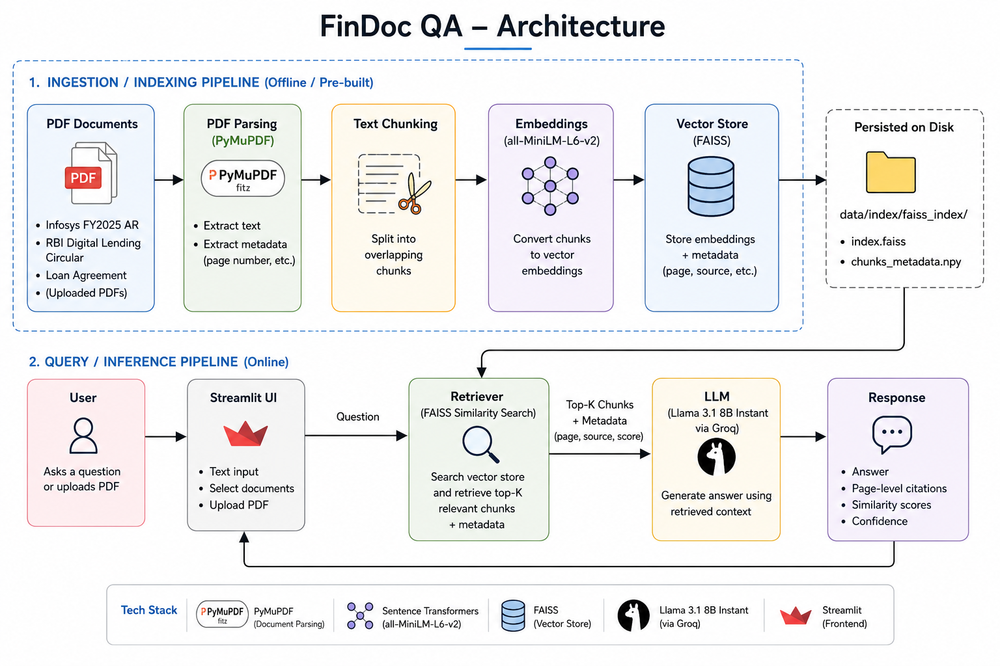
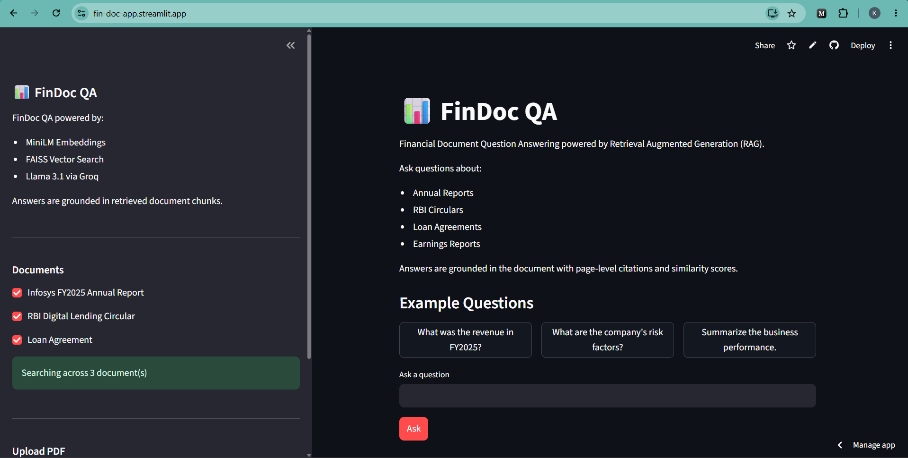
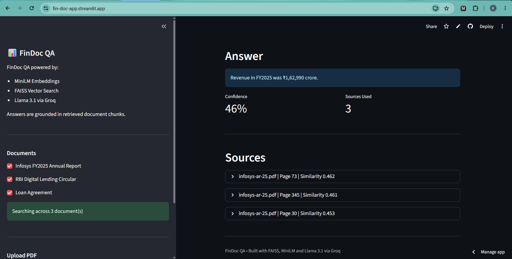
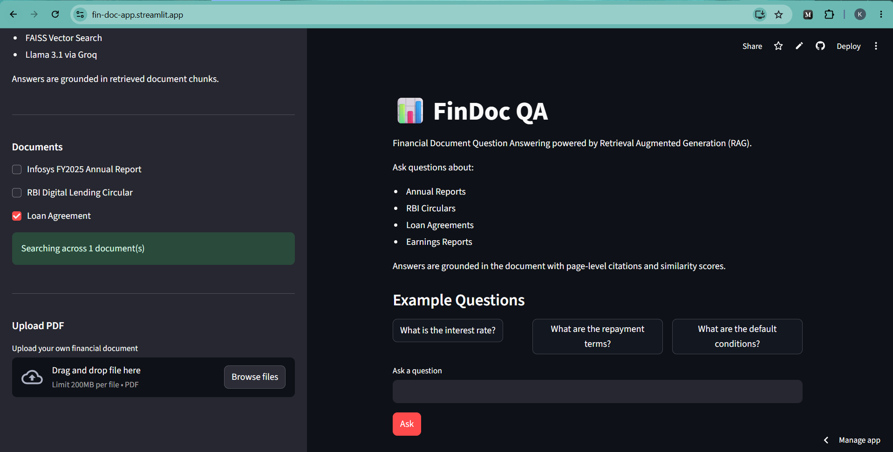

# FinDoc QA

Financial Document Question Answering powered by Retrieval Augmented Generation (RAG).

🔗 **Live Demo:** `https://fin-doc-app.streamlit.app/`

---

## Overview

FinDoc QA is an end-to-end Retrieval Augmented Generation (RAG) system designed for financial documents.

The application allows users to:

* Query multiple financial documents simultaneously
* Upload and analyze custom PDFs
* Retrieve grounded answers using semantic search
* View page-level citations
* Inspect similarity scores and retrieval confidence

The project demonstrates how modern LLMs can be combined with vector search to build explainable question answering systems for enterprise documents.

---

## Features

### Multi-document Question Answering

Select one or more preloaded financial documents and ask questions across all of them.

Included sample documents:

* Infosys FY2025 Annual Report
* RBI Digital Lending Circular
* Loan Agreement

---

### Upload Custom PDFs

Upload any PDF and instantly:

1. Parse the document
2. Chunk the text
3. Generate embeddings
4. Build a FAISS index
5. Ask natural language questions

---

### Explainable Retrieval

Every answer includes:

* Source page numbers
* Similarity scores
* Source chunk previews
* Confidence estimates

---

## Architecture



---

## Tech Stack

| Component    | Technology                             |
| ------------ | -------------------------------------- |
| Frontend     | Streamlit                              |
| LLM          | Llama 3.1 8B Instant                   |
| LLM Provider | Groq                                   |
| Embeddings   | sentence-transformers/all-MiniLM-L6-v2 |
| Vector Store | FAISS                                  |
| PDF Parsing  | pymupdf                             |
| Language     | Python                                 |

---

## Project Structure

```text
findoc_qa/

├── app.py
├── requirements.txt
├── README.md
├── .env
├── data
│   ├── index
│   │   └── faiss_index
│   │       ├── index.faiss
│   │       └── chunks_metadata.npy
│   │
│   └── pdfs
│       ├── infosys-ar-25.pdf
│       ├── loan_agreement.pdf
│       └── rbi_digital_lending.pdf

└── rag
    ├── embeddings.py
    ├── eval_rag.py
    ├── generate.py
    ├── ingest.py
    ├── pipeline.py
    ├── vector_store.py
    └── __init__.py
```

---

## Installation

Clone the repository:

```bash
git clone https://github.com/kshitijmaurya-963/findoc_qa.git

cd findoc_qa
```

Install dependencies:

```bash
pip install -r requirements.txt
```

Create a `.env` file:

```env
LLM_API_BASE=https://api.groq.com/openai/v1

LLM_API_KEY=YOUR_GROQ_API_KEY

LLM_MODEL_NAME=llama-3.1-8b-instant

EMBEDDING_MODEL_NAME=sentence-transformers/all-MiniLM-L6-v2
```

Run the application:

```bash
streamlit run app.py
```

---

## Example Questions

### Infosys Annual Report

* What was Infosys revenue in FY2025?
* What are the major growth drivers?

### RBI Digital Lending Circular

* What are the customer consent requirements?
* What rules govern digital lending apps?

### Loan Agreement

* What constitutes an event of default?
* What are the obligations of the borrower?

### Cross-document Questions

* Which documents discuss regulatory compliance?
* Compare customer obligations across the documents.

---

## Screenshots

### Home Page



### Answer with Citations



### Upload PDF



---

## Future Improvements

* Hybrid retrieval (BM25 + Dense Retrieval)
* Cross-encoder reranking
* Streaming responses
* Conversation memory
* Evaluation dashboard with RAG metrics
* Support for additional document formats

---

## License

This project is intended for educational and portfolio purposes.
